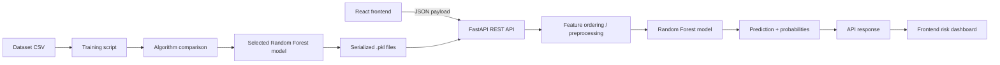

# System Architecture

The project follows a simple end-to-end pipeline for AI-assisted OA risk screening.

## Components

### 1. Frontend
The React + Vite frontend presents the screening flow, validates input, sends the request to the API, and displays the result card and probability information.

### 2. FastAPI backend
The backend validates request data, reshapes it into the model feature order, loads the saved Random Forest model, runs prediction, computes healthy and OA probabilities, and returns a JSON response.

### 3. Training pipeline
The dataset is loaded, the difficult JPR columns are normalized, a defined feature list is selected, and the model comparison process runs using stratified 5-fold cross-validation.

### 4. Model persistence
The selected model and feature list are saved to the `models/` directory as:

- `oa_model.pkl`
- `features.pkl`

## Output flow

The API response includes fields such as:

- `prediction`
- `result`
- `risk_level`
- `healthy_probability`
- `oa_probability`
- `message`
- `disclaimer`

The frontend uses these values to display a screening result and recommendation without hardcoding predictions.
