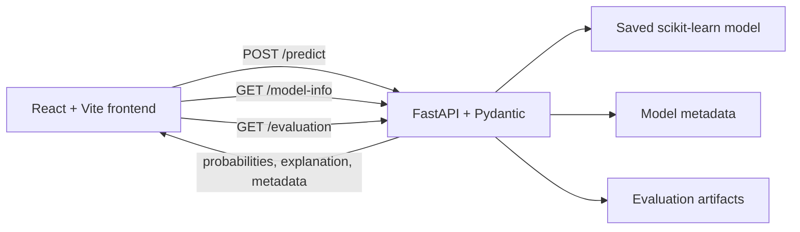

# System architecture

OA-SCAN separates data preparation, model training, API inference, and presentation.

## Frontend

The frontend validates the screening form, calculates BMI, and submits only age, gender, BMI, and VAS score. It renders prediction values from `/predict` and model/evaluation values from `/model-info` and `/evaluation`. Evaluation scores, provenance counts, confusion-matrix values, and importance values are not embedded in the React source.

## Backend

FastAPI applies strict Pydantic validation, restores the saved feature order, loads the selected model, generates class probabilities, assigns the prototype risk category, and calculates a model-based explanation. Aggregate model evidence is exposed without returning subject-level dataset rows.

## Data preparation

`ml/generate_synthetic_data.py` always starts from the preserved original CSV. It validates the source, creates deterministic SMOTENC candidates, removes duplicate and real-overlapping feature vectors, selects the required balanced synthetic rows, attaches provenance, and writes the active dataset plus a quality report. Provenance remains available for audit, while all active rows are modeled together.

## Training and evaluation

`ml/train_model.py` performs stratified outer cross-validation over the complete active dataset. The 88 observed rows and 500 generated rows are passed to each model as one unified table; no fold-local augmentation or source-based exclusion is applied. Candidate models are selected by mean F1, while per-fold metrics and provenance-tagged fold assignments are preserved.

Calibration is evaluated with active rows drawn only from the outer training partition. Permutation importance is calculated on untouched outer validation rows. The final selected estimator, feature order, model metadata, tables, and plots are persisted for inference and demonstration.

## Artifact flow

- `models/oa_model.pkl`: selected fitted estimator.
- `models/features.pkl`: required feature order.
- `models/model_metadata.json`: configuration, provenance, validation, selection, and artifact hashes.
- `docs/results/*.csv`: generated evaluation evidence.
- `docs/results/*.png`: generated static plots.
- `data/synthetic_data_quality_report.json`: generated provenance and distribution report.

The frontend should be demonstrated against the running backend so displayed figures always reflect the currently loaded artifacts.
